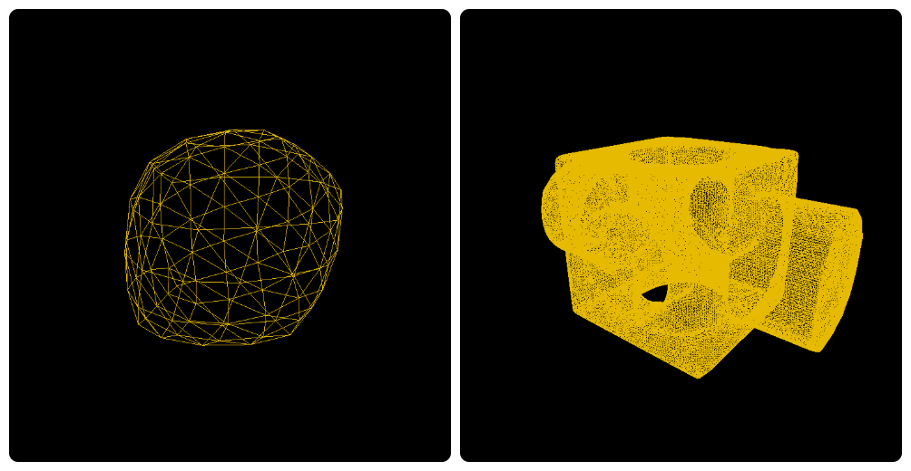
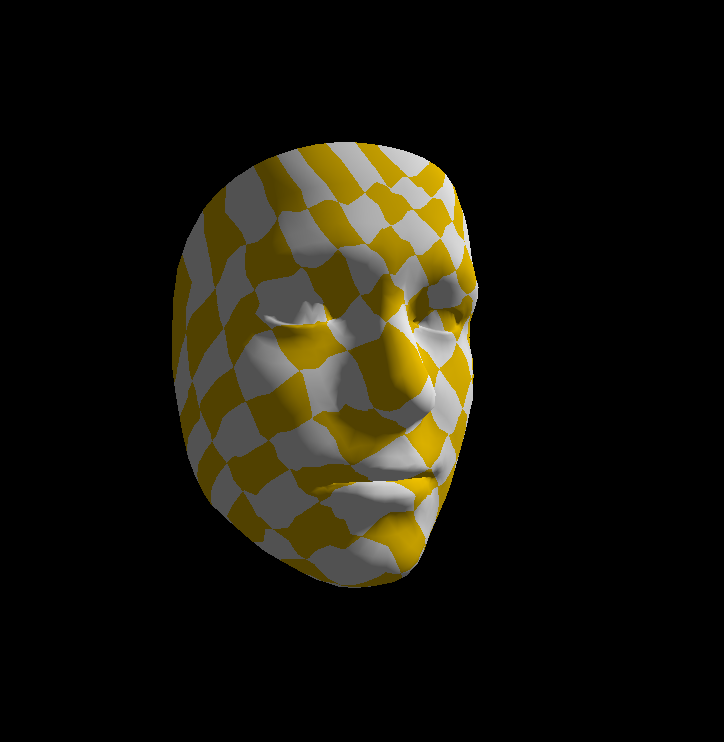
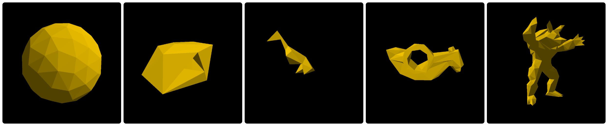
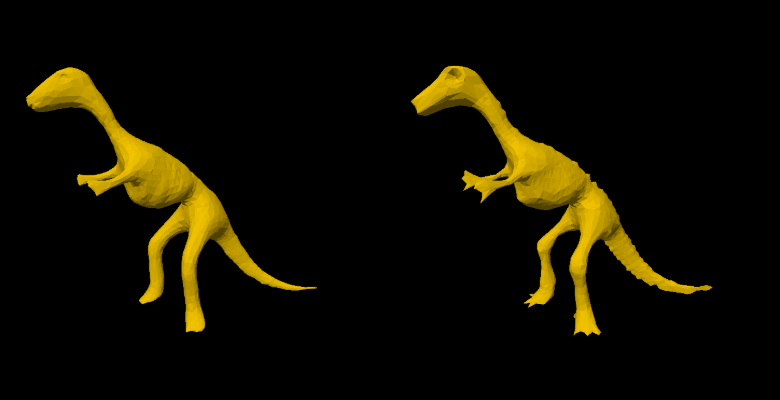
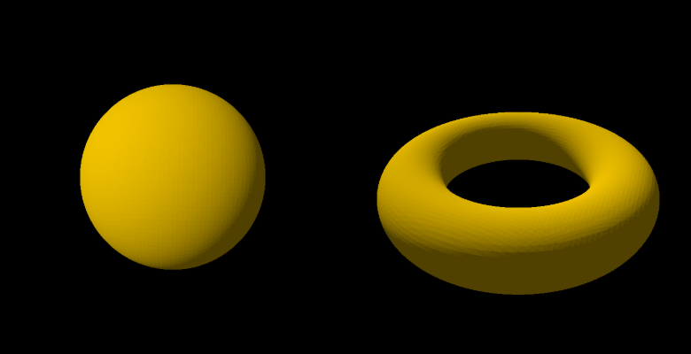

# VCL报告：lab2:

## Task 1: Loop Mesh Subdivision

这是**cube.obj**和**block.obj**迭代两次的结果

**思路：**

- 对于原有的每个顶点，将它们加入到新 Mesh 中，在新 Mesh 中重新计算它们的位置；这个阶段计算时用${v}' = (1 - n \cdot u)\mathbf{v} + \sum_{i=1}^{n} u\,\mathbf{v}_i$计算，其中当$n=3$时$u=3/16$,否则$u=\frac{3}{8n}$
-  遍历原有的每一条边，在边上产生新的顶点，计算它们的位置，区分在边界上和不在边界上两种情况，并push到curr_mesh.Positions中。
- 最后并在新 Mesh 中连接顶点，形成新的面

## Task 2: Spring-Mass Mesh Parameterization

迭代最大次数结果如上

**思路：**

- 维护一个有顺序的边界点索引数组，首先找到一个边界点，然后通过BoundaryNeighbors()函数找到不在索引中的下一个点，直到Pair内的两个点都在数组中就当已经转过一圈了。
- 用整数除法和余数，把点数尽量均匀分配到4条边，然后均匀洒下得到不变的边界点u,v值。
- 迭代求解中间点上的 UV 坐标，简单起见使用平均系数作为仿射组合系数，随后通过 Gauss-Seidel 迭代求解方程组，遍历每个点，边界点不变，非边界点取所以邻点的均值。

## Task 3: Mesh Simplification

最高简化等级下简化结果如下

**思路:**

your code here1:

这部分代码的目的是计算一个三角面片 `f` 的二次误差度量（Quadric Error Metric, QEM）矩阵 `Kp`。
1.  **获取顶点**：首先从面片 `f` 中获取其三个顶点的三维坐标 `v1`, `v2`, `v3`。
2.  **计算平面方程**：利用这三个顶点确定一个平面。通过计算两条边向量 (`v1-v2` 和 `v1-v3`) 的叉积，得到平面的法向量 `v`，并将其单位化。
3.  **构造平面向量**：根据法向量 `v` 和任一点 `v1`，计算出平面方程 `ax + by + cz + d = 0` 中的 `d` 值。这样就得到了一个四维向量 `p = [v.x, v.y, v.z, d]`。
4.  **计算 Kp 矩阵**：`Kp` 矩阵是四维平面向量 `p` 和其转置 `p^T` 的外积（`Kp = p * p^T`）。这个矩阵可以用来计算任意点到该平面的距离的平方。

your code here2:

这部分代码为一条待收缩的边计算最佳目标收缩点和收缩代价。
1.  **求解最佳位置**：一条边的两个顶点 `v1`, `v2` 的误差矩阵之和为 `Q = Q1 + Q2`。收缩后的最佳目标顶点位置 `target_p` 是使得误差 `v^T * Q * v` 最小化的点 `v`。这个点可以通过求解一个线性方程组来找到。如果 `Q` 的左上角 3x3 矩阵可逆，则最佳位置可以直接解出；如果不可逆（行列式接近零），则简化处理，直接取两个端点的中点作为目标位置。
2.  **计算收缩代价**：将计算出的最佳目标位置 `targetPosition` (齐次坐标) 代入二次误差公式 `cost = targetPosition^T * Q * targetPosition`，得到收缩这条边的代价。
3.  **返回结果**：将待收缩的边、计算出的目标位置和代价封装成一个 `ContractionPair` 结构体并返回。

your code here3:

这部分代码在执行一次边收缩操作后，更新受影响的顶点和边的信息。
1.  **更新邻接面的 Q 矩阵**：边收缩导致保留顶点 `v1` 的位置更新，因此 `v1` 所有邻接面的几何形状都发生了改变。
    *   遍历 `v1` 的每一个邻接面 `f`。
    *   调用 `UpdateQ` 函数为 `f` 计算新的 `Kp` 矩阵。
    *   计算新旧 `Kp` 矩阵的差值 `delta_Kp`。
    *   将这个差值 `delta_Kp` 累加到该面上除 `v1` 外的其他顶点的 `Qv` 矩阵上，并记录这些被影响的邻居顶点。
    *   用新的 `Kp` 矩阵更新 `v1` 的 `Qv` 矩阵，并更新存储面片 `Kp` 矩阵的 `Kf` 数组。
2.  **更新相关边的收缩代价**：由于 `v1` 和它的邻居顶点的 `Qv` 矩阵发生了变化，连接这些顶点的边的收缩代价也需要重新计算。
    *   遍历所有受影响的顶点（`v1` 和它的邻居们）。
    *   对于每个受影响顶点，遍历其所有的邻接边 `e`。
    *   如果这条边 `e` 存在于 `pair_map` 中（意味着它是一个可以收缩的候选项），则使用更新后的端点 `Qv` 矩阵之和，调用 `MakePair` 函数重新计算它的收缩目标和代价，并更新 `pairs` 数组中对应的内容。

## Task 4: Mesh Smoothing 

最大迭代次数下均匀权重和余切权重的恐龙

**思路：**

1.  **`useUniformWeight = true` (均匀权重拉普拉斯平滑)**:
    *   每个邻近顶点的权重都相等（为1）。
    *   新位置就是所有邻近顶点位置的**算术平均值**。
2.  **`useUniformWeight = false` (余切权重拉普拉斯平滑)**:
    *   每个邻近顶点 `j` 的权重 `wij` 不再是1，而是根据共享边 `ij` 的**对角的两个余切值（cotangent）之和**来计算。
    *   **余切权重计算方法**:
        1.  **找到两个对角**：对于边 `ij`（连接当前顶点 `i` 和邻居 `j`），这条边被两个三角形共享。代码通过 `l[0]` 和 `l[1]` 找到了这两个三角形的另外两个顶点，我们称之为 `k` 和 `l`。
    
        2.  **计算第一个余切值 `cot(α)`**：
            *   在三角形 `ikj` 中，`α` 是顶点 `k` 处的角（边 `ij` 的对角）。
            *   代码通过向量点积 (`dot`) 和叉积的模长 (`cross`)，利用公式 `cot(α) = dot(ki, kj) / |cross(ki, kj)|` 计算出第一个余切值。
    
        3.  **计算第二个余切值 `cot(β)`**：
            *   在三角形 `ilj` 中，`β` 是顶点 `l` 处的角（边 `ij` 的另一个对角）。
            *   代码用同样的方法，计算出第二个余切值 `cot(β)`。
    
        4.  **求和**：最终的权重 `wij` 就是这两个余切值之和：`wij = cot(α) + cot(β)`。
    *   新位置是所有邻近顶点位置的**余切加权平均值**。

最终，通过 `numIterations` 次迭代，顶点被逐步拉向其邻域的中心，从而实现整体的平滑效果。

## Task 5: Marching Cubes 

**思路:**

1.  **遍历立方体**：对网格中的每一个小立方体，首先计算其8个顶点的SDF值，并根据正负生成一个8位的 `case_idx` 索引，作为该立方体表面穿插情况的唯一标识。

2.  **确定相交边**：使用 `case_idx` 查询预计算表 `c_EdgeStateTable`，得到一个12位的 `edge_state`，它指明了表面穿过了当前立方体的哪几条边。

3.  **生成/复用顶点**：遍历12条边，如果某条边被穿过：
    *   为该边创建一个全局唯一的 `EdgeKey`（基于其整数坐标和方向）。
    *   用此 `key` 查询 `map`，检查顶点是否已被相邻立方体创建。
    *   **如果已存在**，则复用其索引。
    *   **如果不存在**，则通过线性插值计算出表面与该边交点的精确位置，将新顶点加入 `output.Positions`，并将其索引存入 `map`。

4.  **构建三角形**：最后，再次使用 `case_idx` 查询 `c_EdgeOrdsTable`，得到构成三角形所需的**边的索引**。根据这些边的索引，从上一步准备好的顶点中查出相应的顶点索引，并将它们三个一组存入 `output.Indices`，从而构成三角面片。
