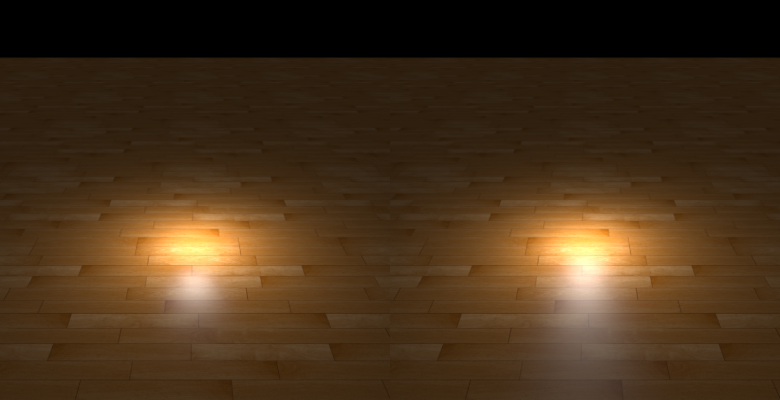
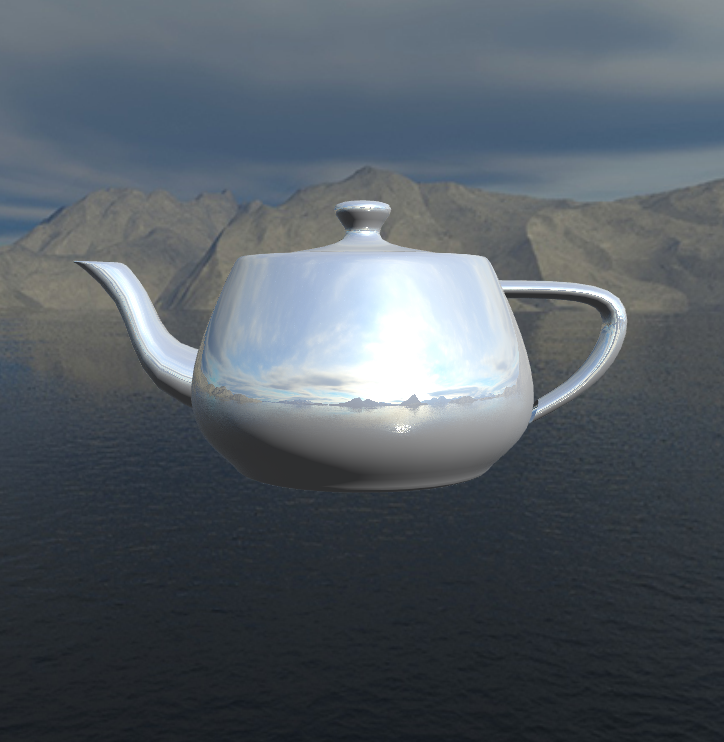
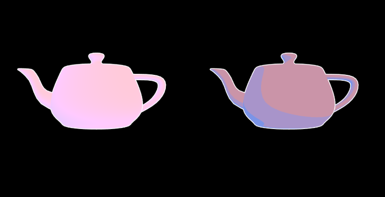
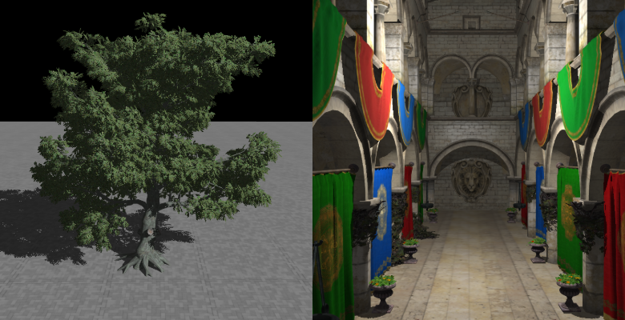
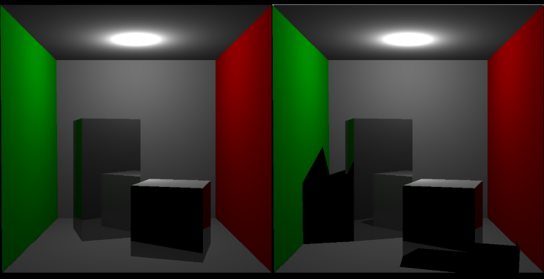

# VCL报告：lab3:
## Task 1：**Loop Mesh Subdivision**

**实现效果：**



思路：

- **漫反射（Diffuse）：** 计算**朗伯体（Lambertian）**漫反射项 $\max(0, \mathbf{N} \cdot \mathbf{L})$，即法线 ($\mathbf{N}$) 与光线方向 ($\mathbf{L}$) 的点积，决定了光照的亮度。
- **高光（Specular）：** 根据 `u_UseBlinn` 的布尔值，选择计算 **Blinn-Phong 模型**（使用**半角向量** $\mathbf{H}$）或 **Phong 模型**（使用**反射向量** $\mathbf{R}$）的高光角度。该角度被提升至 `shininess` 次幂。
- **组合输出：** 将漫反射贡献（$\text{diffuseColor} \cdot \text{diff}$）和高光贡献（$\text{specularColor} \cdot \text{spec}$）相加，并乘以光源强度 $\text{lightIntensity}$，返回最终的着色颜色。

对问题的回答：

1. 顶点着色器和片段着色器的关系是什么样的？顶点着色器中的输出变量是如何传递到片段着色器当中的？

   它们的关系是**生产者与消费者**的关系

   **顶点着色器（生产者）：** 接收每个顶点的输入（位置、法线、纹理坐标等），主要负责**几何变换**（将顶点从模型空间转换到裁剪空间）和**准备数据**。

   **光栅化器（中介）：** 将顶点着色器输出的几何图元（如三角形）转换成屏幕上的**片段（Fragments）**。

   **片段着色器（消费者）：** 对光栅化器生成的每个片段进行处理，主要负责**着色**（计算最终的颜色）。

   顶点着色器中的输出变量是通过 **`out`** 关键字声明的。片段着色器通过匹配的 **`in`** 关键字声明变量来接收这些数据。

2. 代码中的 `if (diffuseFactor.a < .2) discard;` 这行语句，作用是什么？为什么不能用 `if (diffuseFactor.a == 0.) discard;` 代替？

   这行代码实现了**Alpha 测试（Alpha Testing）**，用于处理具有**透明度遮罩（Alpha Masking）**的纹理。如果纹理的 Alpha 值低于一个设定的阈值（此处为 0.2），则完全放弃渲染这个片段，实现**硬边缘**的透明效果（例如，绘制带孔的树叶、铁丝网或草地）。不能简单地用 `== 0.0` 代替，首先是浮点精度的问题，使用==0.0可能会导致应该被剔除的片段会被错误保留，其次用.2还可以保证硬边缘的清晰度。最后因为可以控制阈值故可以进行艺术控制，比0.0更具通用性

## Task 2：**Environment Mapping**

**实现效果**：



思路：

- skybox.vert中将观察矩阵的平移分量去除，以实现无视差效果
- envmap.frag中以反射的视线直接查询颜色

## Task 3：**Non-Photorealistic Rendering**

**实现效果**：非量化与量化



思路：

- `Shade()`函数计算$\alpha$，一开始未量化，生成左图，为了生成从冷色到暖色的过渡，并且有卡通效果的颜色分界线，定义`u_Color_Steps`，通过`float quantizedAlpha = floor(alpha * u_ColorSteps) / u_ColorSteps;`进行量化得到右图。
- main()中则正常计算环境光，点光源和平行光。

对问题的回答：

1. 参考 Labs/3-Rendering/CaseNonPhoto.cpp 中的 `OnRender` 函数，代码是如何分别渲染模型的反面和正面的？

   答：先渲染反面，用    `glCullFace(GL_FRONT)`和`glEnable(GL_CULL_FACE)`进行正面剔除，然后使用描边着色器绘制反面；再渲染正面，用`glCullFace(GL_BACK)`启用正面剔除，然后用`glEnable(GL_DEPTH_TEST)`启用深度测试功能使正面覆盖反面，用 Gooch 着色器进行计算。

2. npr-line.vert 中为什么不简单将每个顶点在世界坐标中沿着法向移动一些距离来实现轮廓线的渲染？这样会导致什么问题？

   在世界坐标中沿法线移动顶点会因为透视关系近大远小导致**描边宽度不一致（Perspective Inconsistency）**。

   代码中用

   ```glsl
   vec2 offset = normalize(clipNorm.xy) / vec2(u_ScreenWidth, u_ScreenHeight) * u_LineWidth * clipPos.w * 2;
   ```

   这个计算偏移量，远处的点在经过透视投影后，其 $\text{clipPos.w}$ 值会更大。用 $\mathbf{w}$ 乘以偏移量，确保离相机越远的顶点，其在裁剪空间中被移动的距离**越大**。

## Task 4：**Shadow Mapping**

实现效果：左平行光，右点光源



思路：

- 平行光算距离用  `float closestDepth = texture(u_ShadowMap,pos.xy).r;`
- 点光源算距离用  `float closestDepth = texture(u_ShadowCubeMap,toLight).r* u_FarPlane;`

对问题的回答：

1. 想要得到正确的深度，有向光源和点光源应该分别使用什么样的投影矩阵计算深度贴图？

   平行光用正交投影矩阵，点光源用透视投影矩阵，且要分成6个面，每个面的FOV为90度

2. 为什么 phong-shadow.vert 和 phong-shadow.frag 中没有计算像素深度，但是能够得到正确的深度值？

   因为shadowmap.vert 和 shadowmap.frag 已经生成有向光源的阴影贴图；再用texture(u_ShadowMap, pos.xy).r直接读取即可；而在光空间的位置v_LightSpacePosition在顶点着色器  v_LightSpacePosition = u_lightSpaceMatrix * vec4(v_Position, 1.);计算得出。经透视除法和范围映射，获得当前片段在光照视角的 **归一化深度** (`pos.z`)。

## Task 5：**Whitted-Style Ray Tracing**

**实现效果**：



**思路**：

- 在IntersectTriangle用Möller–Trumbore 算法计算交点和u,v坐标
- 在 `RayTrace` 中用向光的方向发射一条线判断有无被遮挡，然后用phong模型计算

**对问题的解答**：

1. 光线追踪和光栅化的渲染结果有何异同？如何理解这种结果？

   光栅化的渲染结果常伴随生硬的阴影和受限的屏幕空间反射，而光线追踪则能呈现出符合物理规律的软阴影、完美的全局反射以及物体间相互影响的漫反射（色溢）。

   理解这种差异的关键在于：光栅化是依靠“投影”和预设技巧来模拟视觉效果的局部作画，而光线追踪是真正通过计算光路在场景中反弹传播来还原真实世界的物理模拟。
