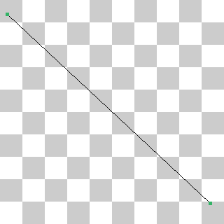
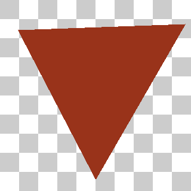
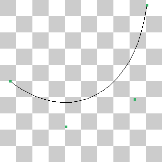

# VCL报告：lab1:

## Task 1: Image Dithering

#### 实现效果

.png)

#### 实现思路

1. **Uniform Random**：用梅森旋转算法作为伪随机数生成引擎，给每个像素加上 [−0.5,0.5] 中均匀分布的随机扰动，然后使用 Threshold 算法。
2. **Blue Noise Random**：`glm::vec3 color = noise.At(x, y) + input.At(x, y) - 0.5f;`，减0.5f使蓝噪声均值为零再加到每个像素上，然后使用 Threshold 算法。
3. **Ordered**：按照讲义中的有序抖动算法，取$M=\begin{pmatrix}6&8&4\\1&0&3\\5&2&7 \end{pmatrix}$
4. **Error Diffuse**：采用讲义中的Floyd-Steinberg Error Diffusion。


## Task 2: Image Filtering

#### 实现效果

.png)

#### 实现思路

对于图像模糊，卷积核用$\begin{pmatrix}
1&1&1\\
1&1&1\\
1&1&1
\end{pmatrix}$

对于图像边缘提取，用$\begin{pmatrix}
-1&0&1\\
-2&0&2\\
-1&0&1
\end{pmatrix}$提取水平梯度，用$\begin{pmatrix}
-1&-2&-1\\
0&0&0\\
1&2&1
\end{pmatrix}$提取竖直梯度，然后对二者平方运算后再求和，最后取平方根。

## Task 3: Image Inpainting

#### 实现效果


#### 实现思路

将边界点的初始值置为背景图对应位置的像素值与飞机图片像素值的差值即可

## Task 4: Line Drawing

#### 实现效果



#### 实现思路

1. **区分直线斜率情况**：
   - 算法首先判断直线的水平变化量 (dx) 和垂直变化量 (dy) 的大小
   - 当 | dx| ≥ |dy | 时（斜率绝对值≤1），以 x 轴为主要步进方向
   - 当 | dx| <|dy | 时（斜率绝对值> 1），以 y 轴为主要步进方向
2. **统一处理方向**：
   - 对于 x 为主方向的情况，确保从左到右绘制（x0 < x1）
   - 对于 y 为主方向的情况，确保从下到上绘制（y0 < y1）
   - 通过 step 变量（stepy 或 stepx）处理反方向的情况
3. **使用误差累积算法**：
   - 定义一个误差累积变量 F，用于决定下一个像素点的位置
   - 每次步进主方向（x 或 y）时，根据误差值判断是否需要在副方向（y 或 x）上也步进
   - 通过预计算的增量（d2y、dxdy 等）更新误差值，避免重复计算
4. **绘制像素点**：
   - 在循环过程中，根据计算出的 (x,y) 坐标，通过 canvas.At (i,y) = color 设置像素颜色
   - 整个过程仅使用整数运算，效率高

## Task 5: Triangle Drawing

#### 实现效果



#### 实现思路

我实现了扫描线算法来填充三角形，并可拓展到多边形，主要步骤如下：

1. **边结构定义**：
   - 定义了Edge结构，存储每条边的斜率(m)、y范围(miny/maxy)和当前x坐标
   - 在构造函数中确保a.y ≤ b.y，计算斜率。
2. **边处理**：
   - 创建三条边(p0p1, p0p2, p1p2)
   - 移除水平边（miny == maxy）
   - 按miny从大到小排序边
3. **扫描线处理**：
   - 初始化活动边表(AET)
   - 从最小y开始逐行扫描
   - 每行中：
     - 更新活动边的x值
     - 收集所有交点并排序
     - 两两配对交点并填充像素
     - 移除已完成边(y ≥ maxy)
     - 添加新进入的边(miny == 当前y)

## Task 6: Image Supersampling

#### 实现效果

.png)

#### 实现思路

首先找到输出图像像素对应在输入图像中的区域，并找到其起点（坐标为 x×stepX, y×stepY，其中 stepX 和 stepY 是输入图像到输出图像的缩放步长）。然后，在该区域内均匀采样 rate × rate 个点（每个采样点位于子像素中心，位置通过偏移计算得到）。

对于每个采样点，使用双线性插值获取输入图像中的颜色值：先定位采样点周围的四个邻近像素，并计算权重，然后进行加权平均插值。最后，将所有采样点的颜色值求和并除以采样点数（rate²），得到输出像素的最终颜色，从而实现超采样抗锯齿（SSAA）的效果。

## Task 7: Bezier Curve

#### 实现效果



#### 实现思路

源代码如下：

```c++
    glm::vec2 CalculateBezierPoint(
        std::span<glm::vec2> points,
        float const          t) {
        // your code here:
        std::vector<glm::vec2> Points(points.begin(), points.end());
        size_t n=Points.size()-1;
        for (size_t r=0;r<n;r++){
            for(size_t i=0;i<n-r;i++){
                Points[i]=glm::mix(Points[i],Points[i+1],t);
            }
        }

        return Points[0];
    }
```

使用**德卡斯特里奥算法**递归n-1次最终剩下1个点，即为所求的点。期间采用glm::mix简化插值运算。